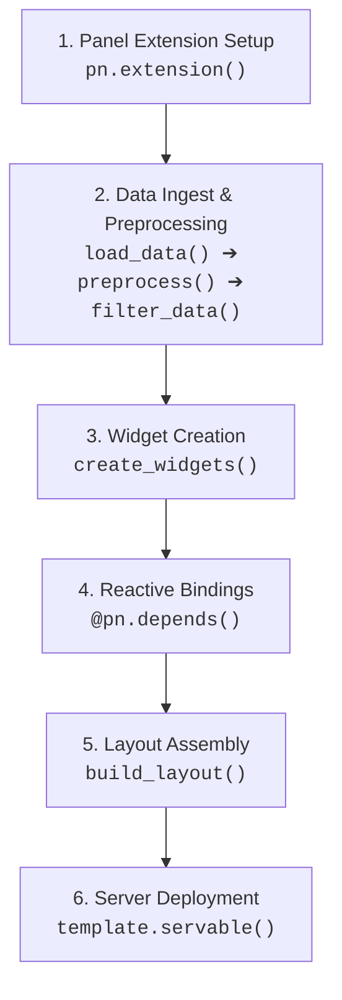

# Documentation: EU Energy Map

## 📌 Summary

An interactive dashboard that visualizes Eurostat data on renewable energy developments across European countries. Built with Python and Panel, the web app provides an intuitive interface to explore renewable energy trends from 2004 to 2024.

## 📦 Python Dependencies

- **Core:** `os`, `json`
- **Data Handling:** `pandas`, `geopandas`
- **Visualization:** `plotly.express`, `plotly.graph_objects`, `plotly.io`
- **Dashboard UI:** `panel`

## 📊 Datasets

### 1. Renewable Energy Data (Eurostat) - 2004–2022

- **File:** `nrg_ind_ren_linear_old.csv`
- **Source:** [Eurostat – Renewable Energy](https://ec.europa.eu/eurostat/databrowser/view/nrg_ind_ren/default/table?lang=en)
- **Years:** 2004–2022
- **Columns:** Country codes, energy type, unit, value (%), flags
- **Categories:** Total renewables, electricity, heating/cooling, transport

### 2. Renewable Energy Data (Eurostat) - 2015–2024

- **File:** `nrg_ind_ren_linear.csv`
- **Source:** [Eurostat – Renewable Energy](https://ec.europa.eu/eurostat/databrowser/view/nrg_ind_ren/default/table?lang=en)
- **Years:** 2015–2024
- **Columns:** Country names, energy type, unit, value (%), flags, confidentiality status
- **Categories:** Total renewables

### 3. Geographic Boundaries (GISCO - Eurostat)

- **File:** `europe.geojson`
- **Source:** [GISCO – Eurostat](https://ec.europa.eu/eurostat/web/gisco/geodata/administrative-units/countries)
- **Year:** 2024
- **Format:** GeoJSON (EPSG:4326), scale 1:20M

## 📁 Contents

```txt
eu-energy-map/
|
├── app.py                            # Main dashboard entry point
├── config.py                         # Configurations (tokens, paths, etc)
|
├── docs/
│   ├── documentation.md              # Project Documentation
│   └── notebook.ipynb                # Interactive Notebook
|
├── data/
│   ├── loader.py                     # Loads and merges CSV/GeoJSON data
│   ├── filters.py                    # Preprocessing and filtering logic
│   ├── nrg_ind_ren_linear_old.csv    # Eurostat renewable energy data
│   └── nrg_ind_ren_linear.csv        
|
├── components/
│   ├── charts/
│   │   ├── bar_chart_by_country.py   # Bar chart: Country vsU
│   │   └── bar_chart_by_year.py      # Bar chart: All countries by year
│   ├── map.py                        # Interactive choropleth map
│   └── widgets.py                    # Dashboard widgets (sliders, selectors)
|
├── layout/
│   └── dashboard.py                  # Layout composition for Panel
|
├── utils/                            # Helper functions
│   ├── colors.py                     # Color scales & conversion
│   └── flags.py                      # ISO2 code → emoji flag
|
├── assets/
│   ├── europe-renewables-500px.png   # Dashboard image
│   └── logo-500px.png               # Logo
|
└── geo/
    └── europe.geojson                # European country boundaries (GeoJSON)
```

## 📖 Documentation

### 1. Main dashboard entry point: `app.py`

`app.py` acts as the orchestrator of the entire application. It initializes the web framework, runs the data ingestion and transformation pipeline, instantiates interactive widgets, binds reactive callbacks to visualization generators, and serves the assembled dashboard.

#### Imports & Packages

The script organizes dependencies into standard library utilities, third-party frameworks, and local modular components:

##### **Standard Library:**
  * **`pathlib.Path`**: Provides cross-platform, OS-independent path resolution relative to `__file__`. Ensures datasets and GeoJSON files are resolved reliably regardless of the working directory from which `panel serve` is executed.
  * **`typing.cast`**: Provides static type hinting, explicitly asserting that raw objects returned from data loading conform to `pd.DataFrame` and `gpd.GeoDataFrame` for code clarity and linter validation.

##### **Third-Party Frameworks:**
  * **`panel (pn)`**: The core reactive dashboard framework. Manages the Bokeh server lifecycle, JavaScript/CSS extension loading, interactive widget synchronization, reactive function decorators (`@pn.depends`), and the template layout.
  * **`pandas (pd)`**: The primary data manipulation engine used for filtering, slicing, aggregating, and passing structured tabular data to charts.
  * **`geopandas (gpd)`**: Extends Pandas with geospatial capabilities, managing European country geographic boundaries and geometry attributes as a `GeoDataFrame`.

##### **Application Modules:**
  * **`data.loader (load_data)`**: Loads raw CSV files and GeoJSON into DataFrames.
  * **`data.filters (preprocess, filter_data)`**: Merges energy metrics with country boundaries, cleans columns, normalizes country codes, filters for EU member states, and calculates EU-wide aggregate averages.
  * **`components.widgets (create_widgets)`**: Factory function creating the interactive UI controllers (the Year slider and Country selector).
  * **`components.map (create_choropleth_map)`**: Generates the interactive Plotly MapLibre choropleth map.
  * **`components.charts.bar_chart_by_year (create_bar_chart_year)`**: Builds the ranked bar chart for all EU nations in a given year.
  * **`components.charts.bar_chart_by_country (create_bar_chart_country)`**: Generates the 2004–2024 time-series comparison chart for a selected country.
  * **`layout.dashboard (build_layout)`**: Assembles charts, widgets, description panes, and branding assets into a structured Panel template.

---

#### Application Workflow

The execution flow of `app.py` follows a 6-stage lifecycle:



##### 1. **Panel Initialization (`pn.extension`)**
   Registers required JavaScript dependencies (`'tabulator'`, `'plotly'`), activates the Material Design UI theme, and sets responsive sizing behavior (`sizing_mode='stretch_width'`).

##### 2. **Loading & Preprocessing Data Pipeline**
   * Computes absolute paths for both historical (`nrg_ind_ren_linear_old.csv`) and modern (`nrg_ind_ren_linear.csv`) datasets alongside `europe.geojson`.
   * Loads raw inputs via `load_data(..., return_raw=True)`.
   * Merges tabular data with geographic polygons using `preprocess()`.
   * Validates DataFrame types and extracts clean subsets via `filter_data()`:
     * `df_renewable`: Individual country metrics filtered to EU member states.
     * `df_eu_total`: Mean annual renewable share across all EU nations.

##### 3. **Widget Creation**

   Calls `create_widgets(df_renewable)` to generate interactive Panel widgets populated with actual data boundaries:
   * **`year_slider`**: An `IntSlider` spanning years 2004–2024 (defaulting to 2024).
   * **`country_select`**: A `Select` dropdown populated with unique, sorted EU country names (defaulting to Germany).

##### 4. **Reactive Bindings (`@pn.depends`)**

   Establishes dynamic event listeners linking widget values to visualization update functions:
   * **`map_view(year)`**: Listens to `year_slider.param.value`, slices `df_renewable` by year, and re-renders the choropleth map.
   * **`bar_by_year(year)`**: Listens to `year_slider.param.value`, slices by year, and re-renders the annual member state comparison bar chart.
   * **`bar_by_country(country)`**: Listens to `country_select.param.value`, filters data for that country, and re-renders the 20-year trajectory comparison chart.

###### 5. **Layout Creation**

   Passes the reactive functions and widgets into `build_layout()`, constructing a responsive side-by-side dashboard structure inside a `FastListTemplate` with navigation tabs, descriptive markdown, and image assets.

##### 6. **Serving the Application (`.servable()`)**

   Attaches the completed template to Bokeh's server document context via `template.servable()`.

---

#### Running the Application

Launch the development server from the repository root:

```bash
panel serve app.py --show --autoreload
```

**Options:**
* `--show`: Automatically opens the dashboard in your default browser at `http://localhost:5006/app`.
* `--autoreload`: Automatically reloads the application when project files are modified.

---

### 2. Configuration: `config.py`

The `config.py` module serves as the central configuration hub for the application. It establishes global UI extension settings, manages external API credentials, and dynamically resolves absolute paths to static visual assets. Centralizing these parameters ensures that filepaths and configurations are not hardcoded across multiple components.

#### Key Configurations

##### 1. Panel Extension Setup (`pn.extension`)
Initializes the HoloViz Panel runtime environment before dashboard components are loaded:
```python
pn.extension('tabulator', 'plotly', design='material')
```
* **`'plotly'`**: Injects the Plotly.js rendering engine into the browser runtime, enabling interactive WebGL/MapLibre map and chart panes.
* **`'tabulator'`**: Loads the Tabulator JavaScript dependency for high-performance interactive data tables.
* **`design='material'`**: Enforces Google Material Design styling across all dashboard widgets, inputs, and template containers for a cohesive look.

##### 2. Dynamic Filesystem Path Resolution (`pathlib.Path`)
Uses Python's `pathlib` to anchor asset paths relative to `config.py` itself, ensuring static assets load reliably across operating systems and deployment environments (local development, Docker containers, or remote servers):

* **`BASE_DIR`**: Resolves the root directory of the repository (`Path(__file__).parent`).
* **`ASSETS_DIR`**: Points to the visual media folder (`assets/`).
* **`LOGO_PATH`**: Path to `assets/logo-500px.png`, used as the header emblem in the dashboard template.
* **`PICTURE_PATH`**: Path to `assets/europe-renewables-500px.png`, displayed as the featured graphic alongside the dashboard description.

---

#### Module Usage Overview

| Variable / Function | Consumer File | Purpose |
| :--- | :--- | :--- |
| **`pn.extension(...)`** | Global runtime | Pre-registers client-side dependencies before UI rendering |
| **`LOGO_PATH`** | [layout/dashboard.py](file:///home/kuranez/Projects_new/python/eu-energy-map/layout/dashboard.py) | Configures top navigation bar logo in `FastListTemplate` |
| **`PICTURE_PATH`** | [layout/dashboard.py](file:///home/kuranez/Projects_new/python/eu-energy-map/layout/dashboard.py) | Renders thumbnail preview image in the descriptive side-panel |

---

### 3. Data Loading & Filtering Pipeline: `data/`

This folder contains Pipeline: filters.py & loader.py.

Dataset nrg_ind_ren_linear_old.csv & nrg_ind_ren_linear.csv from eurostat.

(link above)

Note: remove other dataset, keep for refactor.

### 4. Dashboard Components: `components/`

Contains map.py & widgets.py.

### 5. Dashboard Layout: `layout/`

**Methods**
build_layouts

steps/Components
- title_md
- description_md
- then combination of images and text
- organisation in Tabs
- final layout
- Template

returns template used for app

### 6. Utilities: `utils/`

helpers
- colors.py
- flags.py

### 7. Assets: `assets/`

contains images (note: remove/hide unused images, archive them)

### 8. Geodata: `geo/`

contains geojson for europe
