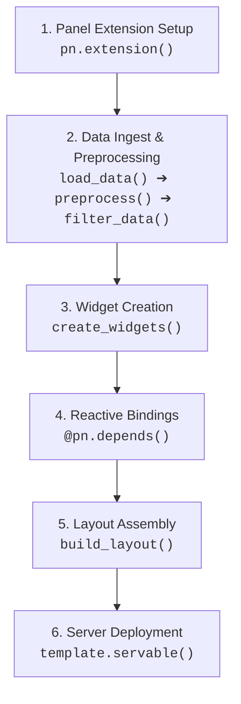
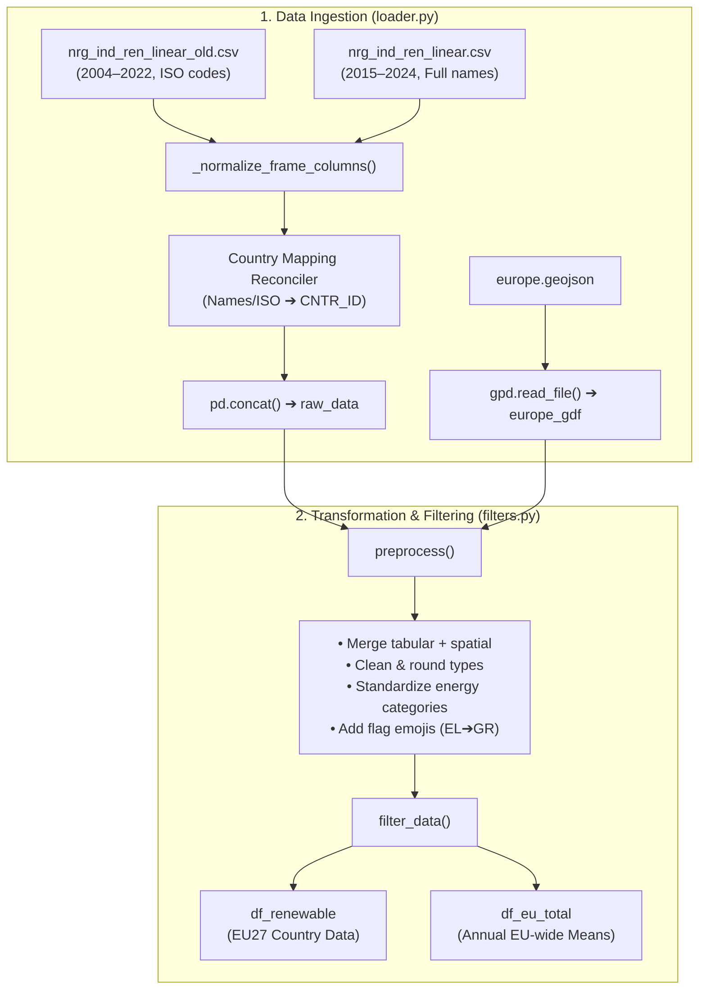
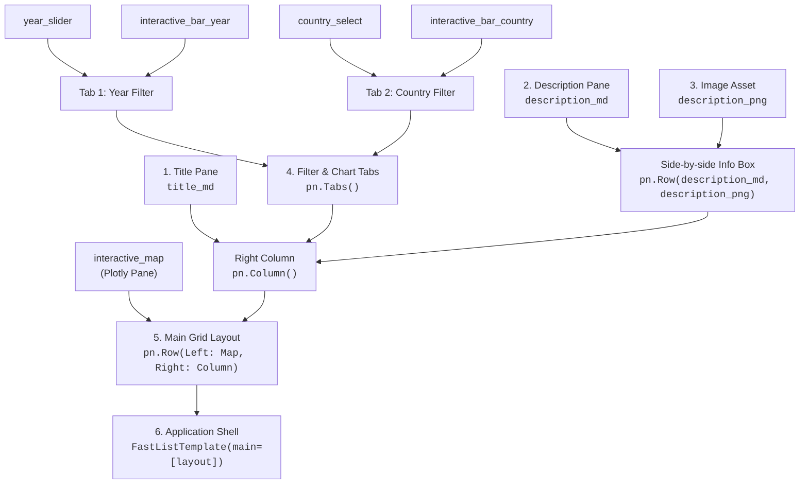

# Documentation: EU Energy Map

## Project Summary

**EU Energy Map** is an interactive geospatial dashboard for tracking and analyzing renewable energy adoption across the European Union from 2004 to 2024.
Built with **Python**, **HoloViz Panel**, and **Plotly**, the application integrates Eurostat data and GISCO geographic boundaries into a cohesive analytical tool. It enables policymakers, researchers, and citizens to:
- **Explore spatial disparities:** Visualize country-by-country renewable adoption using dynamic choropleth maps.
- **Benchmark national progress:** Compare individual member states directly against EU-wide averages over a 20-year transition timeline.
- **Seamless data exploration:** Filter instantly by year and country through a responsive, reactive interface.

---

## 📦 Python Dependencies

- **Core:** `os`, `json`
- **Data Handling:** `pandas`, `geopandas`
- **Visualization:** `plotly.express`, `plotly.graph_objects`, `plotly.io`
- **Dashboard UI:** `panel`

---

## 📊 Datasets

### 1. Renewable Energy Data (Eurostat) - 2004–2022

- **File:** `nrg_ind_ren_linear_old.csv`
- **Source:** [Eurostat – Renewable Energy](https://ec.europa.eu/eurostat/databrowser/view/nrg_ind_ren/default/table?lang=en)
- **Years:** 2004–2022
- **Columns:** Country codes, energy type, unit, value (%), flags
- **Categories:** Total renewables, electricity, heating/cooling, transport

### 2. Renewable Energy Data (Eurostat) - 2015–2024

- **File:** `nrg_ind_ren_linear.csv`
- **Source:** [Eurostat – Renewable Energy](https://ec.europa.eu/eurostat/databrowser/view/nrg_ind_ren/default/table?lang=en)
- **Years:** 2015–2024
- **Columns:** Country names, energy type, unit, value (%), flags, confidentiality status
- **Categories:** Total renewables

### 3. Geographic Boundaries (GISCO - Eurostat)

- **File:** `europe.geojson`
- **Source:** [GISCO – Eurostat](https://ec.europa.eu/eurostat/web/gisco/geodata/administrative-units/countries)
- **Year:** 2024
- **Format:** GeoJSON (EPSG:4326), scale 1:20M

---

## 📁 Contents

```txt
eu-energy-map/
|
├── app.py                            # Main dashboard entry point
├── config.py                         # Configurations (tokens, paths, etc)
|
├── docs/
│   ├── documentation.md              # Project Documentation
│   └── notebook.ipynb                # Interactive Notebook
|
├── data/
│   ├── loader.py                     # Loads and merges CSV/GeoJSON data
│   ├── filters.py                    # Preprocessing and filtering logic
│   ├── nrg_ind_ren_linear_old.csv    # Eurostat renewable energy data
│   └── nrg_ind_ren_linear.csv        
|
├── components/
│   ├── charts/
│   │   ├── bar_chart_by_country.py   # Bar chart: Country vsU
│   │   └── bar_chart_by_year.py      # Bar chart: All countries by year
│   ├── map.py                        # Interactive choropleth map
│   └── widgets.py                    # Dashboard widgets (sliders, selectors)
|
├── layout/
│   └── dashboard.py                  # Layout composition for Panel
|
├── utils/                            # Helper functions
│   ├── colors.py                     # Color scales & conversion
│   └── flags.py                      # ISO2 code → emoji flag
|
├── assets/
│   ├── europe-renewables-500px.png   # Dashboard image
│   └── logo-500px.png               # Logo
|
└── geo/
    └── europe.geojson                # European country boundaries (GeoJSON)
```

---

## 📖 Documentation

### I. Main dashboard entry point: `app.py`

`app.py` acts as the orchestrator of the entire application. It initializes the web framework, runs the data ingestion and transformation pipeline, instantiates interactive widgets, binds reactive callbacks to visualization generators, and serves the assembled dashboard.

---

#### Imports & Packages

The script organizes dependencies into standard library utilities, third-party frameworks, and local modular components:

##### **Standard Library:**
  * **`pathlib.Path`**: Provides cross-platform, OS-independent path resolution relative to `__file__`. Ensures datasets and GeoJSON files are resolved reliably regardless of the working directory from which `panel serve` is executed.
  * **`typing.cast`**: Provides static type hinting, explicitly asserting that raw objects returned from data loading conform to `pd.DataFrame` and `gpd.GeoDataFrame` for code clarity and linter validation.

##### **Third-Party Frameworks:**
  * **`panel (pn)`**: The core reactive dashboard framework. Manages the Bokeh server lifecycle, JavaScript/CSS extension loading, interactive widget synchronization, reactive function decorators (`@pn.depends`), and the template layout.
  * **`pandas (pd)`**: The primary data manipulation engine used for filtering, slicing, aggregating, and passing structured tabular data to charts.
  * **`geopandas (gpd)`**: Extends Pandas with geospatial capabilities, managing European country geographic boundaries and geometry attributes as a `GeoDataFrame`.

##### **Application Modules:**
  * **`data.loader (load_data)`**: Loads raw CSV files and GeoJSON into DataFrames.
  * **`data.filters (preprocess, filter_data)`**: Merges energy metrics with country boundaries, cleans columns, normalizes country codes, filters for EU member states, and calculates EU-wide aggregate averages.
  * **`components.widgets (create_widgets)`**: Factory function creating the interactive UI controllers (the Year slider and Country selector).
  * **`components.map (create_choropleth_map)`**: Generates the interactive Plotly MapLibre choropleth map.
  * **`components.charts.bar_chart_by_year (create_bar_chart_year)`**: Builds the ranked bar chart for all EU nations in a given year.
  * **`components.charts.bar_chart_by_country (create_bar_chart_country)`**: Generates the 2004–2024 time-series comparison chart for a selected country.
  * **`layout.dashboard (build_layout)`**: Assembles charts, widgets, description panes, and branding assets into a structured Panel template.

---

#### Application Workflow

The execution flow of `app.py` follows a 6-stage lifecycle:



##### 1. **Panel Initialization (`pn.extension`)**
   Registers required JavaScript dependencies (`'tabulator'`, `'plotly'`), activates the Material Design UI theme, and sets responsive sizing behavior (`sizing_mode='stretch_width'`).

##### 2. **Loading & Preprocessing Data Pipeline**
   * Computes absolute paths for both historical (`nrg_ind_ren_linear_old.csv`) and modern (`nrg_ind_ren_linear.csv`) datasets alongside `europe.geojson`.
   * Loads raw inputs via `load_data(..., return_raw=True)`.
   * Merges tabular data with geographic polygons using `preprocess()`.
   * Validates DataFrame types and extracts clean subsets via `filter_data()`:
     * `df_renewable`: Individual country metrics filtered to EU member states.
     * `df_eu_total`: Mean annual renewable share across all EU nations.

##### 3. **Widget Creation**

   Calls `create_widgets(df_renewable)` to generate interactive Panel widgets populated with actual data boundaries:
   * **`year_slider`**: An `IntSlider` spanning years 2004–2024 (defaulting to 2024).
   * **`country_select`**: A `Select` dropdown populated with unique, sorted EU country names (defaulting to Germany).

##### 4. **Reactive Bindings (`@pn.depends`)**

   Establishes dynamic event listeners linking widget values to visualization update functions:
   * **`map_view(year)`**: Listens to `year_slider.param.value`, slices `df_renewable` by year, and re-renders the choropleth map.
   * **`bar_by_year(year)`**: Listens to `year_slider.param.value`, slices by year, and re-renders the annual member state comparison bar chart.
   * **`bar_by_country(country)`**: Listens to `country_select.param.value`, filters data for that country, and re-renders the 20-year trajectory comparison chart.

###### 5. **Layout Creation**

   Passes the reactive functions and widgets into `build_layout()`, constructing a responsive side-by-side dashboard structure inside a `FastListTemplate` with navigation tabs, descriptive markdown, and image assets.

##### 6. **Serving the Application (`.servable()`)**

   Attaches the completed template to Bokeh's server document context via `template.servable()`.

---

#### Running the Application

Launch the development server from the repository root:

```bash
panel serve app.py --show --autoreload
```

**Options:**
* `--show`: Automatically opens the dashboard in your default browser at `http://localhost:5006/app`.
* `--autoreload`: Automatically reloads the application when project files are modified.

---

### II. Configuration: `config.py`

The `config.py` module serves as the central configuration hub for the application. It establishes global UI extension settings, manages external API credentials, and dynamically resolves absolute paths to static visual assets. Centralizing these parameters ensures that filepaths and configurations are not hardcoded across multiple components.

---

#### Key Configurations

##### 1. Panel Extension Setup (`pn.extension`)
Initializes the HoloViz Panel runtime environment before dashboard components are loaded:
```python
pn.extension('tabulator', 'plotly', design='material')
```
* **`'plotly'`**: Injects the Plotly.js rendering engine into the browser runtime, enabling interactive WebGL/MapLibre map and chart panes.
* **`'tabulator'`**: Loads the Tabulator JavaScript dependency for high-performance interactive data tables.
* **`design='material'`**: Enforces Google Material Design styling across all dashboard widgets, inputs, and template containers for a cohesive look.

##### 2. Dynamic Filesystem Path Resolution (`pathlib.Path`)
Uses Python's `pathlib` to anchor asset paths relative to `config.py` itself, ensuring static assets load reliably across operating systems and deployment environments (local development, Docker containers, or remote servers):

* **`BASE_DIR`**: Resolves the root directory of the repository (`Path(__file__).parent`).
* **`ASSETS_DIR`**: Points to the visual media folder (`assets/`).
* **`LOGO_PATH`**: Path to `assets/logo-500px.png`, used as the header emblem in the dashboard template.
* **`PICTURE_PATH`**: Path to `assets/europe-renewables-500px.png`, displayed as the featured graphic alongside the dashboard description.

---

#### Module Usage Overview

| Variable / Function | Consumer File | Purpose |
| :--- | :--- | :--- |
| **`pn.extension(...)`** | Global runtime | Pre-registers client-side dependencies before UI rendering |
| **`LOGO_PATH`** | [layout/dashboard.py](file:///home/kuranez/Projects_new/python/eu-energy-map/layout/dashboard.py) | Configures top navigation bar logo in `FastListTemplate` |
| **`PICTURE_PATH`** | [layout/dashboard.py](file:///home/kuranez/Projects_new/python/eu-energy-map/layout/dashboard.py) | Renders thumbnail preview image in the descriptive side-panel |

---

### III. Data Loading & Filtering Pipeline: `data/`

The `data/` directory houses the core data ingestion, harmonization, and transformation pipeline. Its primary role is to bridge raw, multi-format Eurostat exports with geographic boundaries, producing clean, standardized DataFrames for the visualization layer.


The pipeline is split into two specialized modules:
1. **`loader.py`**: Handles file retrieval, schema normalization, country code reconciliation, and multi-file concatenation.
2. **`filters.py`**: Merges tabular metrics with country geometries, standardizes category terminology, filters for official EU member states, and calculates aggregate benchmarks.

---

#### Imports & Dependencies

##### 👉 **`data/loader.py`**
* **`os`**: Performs filesystem verification (`os.path.exists`, `os.PathLike`) to validate that dataset CSVs and GeoJSON files exist before attempting to parse them.
* **`typing (Union, Tuple, Sequence)`**: Enforces strict type signatures, supporting flexible input arguments (single file path string or sequence of file paths) and declaring return types (`Union[pd.DataFrame, Tuple[pd.DataFrame, gpd.GeoDataFrame]]`).
* **`pandas (pd)`**: Used for reading CSV files (`read_csv`), concatenating disparate dataset versions (`concat`), column manipulation, and dictionary-based remapping.
* **`geopandas (gpd)`**: Parses European boundary geometries from GeoJSON (`read_file`) and manages them within a `GeoDataFrame`.
* **`utils.flags (iso2_to_flag)`**: Converts two-letter ISO country codes into corresponding unicode flag emojis.

##### 👉 **`data/filters.py`**
* **`pandas (pd)`**: Drives the core data transformations—spatial/tabular merging (`merge`), dropping metadata columns (`drop`), deduplicating records (`drop_duplicates`), coercing numeric types (`to_numeric`), and computing annual EU averages (`groupby`).
* **`utils.flags (add_country_flags)`**: Vectorized utility that appends national flag emojis to the DataFrame based on sanitized country codes.

---

#### Data Pipeline Workflow



---

#### 1. Ingestion & Reconciliation: `loader.py`

##### ⚙️ **Method documentation: `_normalize_frame_columns(frame)`**  

  Standardizes structural discrepancies across different Eurostat export versions:
  * Detects and harmonizes legacy column names (e.g., renames `siec` to `nrg_bal`).
  * Normalizes category labels (`REN`, `R5110-5150_W6000RIS`) to `'Renewable energy - overall'`.
  * Converts time dimensions (`TIME_PERIOD`) into numeric integers.

##### ⚙️ **Method documentation: `load_data(data_path, geo_path, return_raw=False)`**  

  The primary ingestion function:
  * Reads `europe.geojson` into a GeoPandas `GeoDataFrame`.
  * **Reconciles Country Identifiers:** Eurostat's modern file uses full country names (e.g., `"Germany"`), while the historical file uses 2-letter codes (e.g., `"DE"`). `load_data` dynamically builds a mapping table from the GeoDataFrame (`NAME_ENGL`, `ISO3_CODE`, `CNTR_ID`) to unify all country references under a consistent `CNTR_ID` key (`geo_key`).
  * Concatenates historical and modern records into a single DataFrame.
  * When `return_raw=True` is passed (as in `app.py`), returns the tuple `(raw_data, europe_gdf)`.


#### 2. Preprocessing & Aggregation: `filters.py`

##### ⚙️ **Method documentation: `preprocess(data, europe)`**

  Prepares the raw tabular and spatial data for visualization:
  * Merges the energy data with European country geometries on `CNTR_ID == geo_key`.
  * Renames technical column keys to user-friendly titles:
    * `TIME_PERIOD` to `Year`
    * `OBS_VALUE` to `Renewable Percentage`
    * `NAME_ENGL` to `Country`
    * `nrg_bal` to `Energy Type`
  * Maps Eurostat energy classifications into descriptive labels (e.g., `'Renewable energy - overall'` to `'Renewable Energy Total'`).
  * Strips technical metadata columns (`DATAFLOW`, `OBS_FLAG`, `CONF_STATUS`, `unit`, etc.).
  * Rounds renewable percentages to 1 decimal place.
  * Appends ISO2 country codes (converting Greece `EL` to `GR` for emoji compatibility) and attaches national flag emojis via `add_country_flags()`.
  * Deduplicates overlapping records between the historical and modern files (`keep='last'`).

##### ⚙️ **Method documentation: `filter_data(merged)`**

  Separates the preprocessed data into two specific visual targets:
  1. **`df_renewable`**: Filters records exclusively to the official 27 EU member states (`AT`, `BE`, `BG`, `HR`, `CY`, `CZ`, `DK`, `EE`, `FI`, `FR`, `DE`, `EL`, `HU`, `IE`, `IT`, `LV`, `LT`, `LU`, `MT`, `NL`, `PL`, `PT`, `RO`, `SK`, `SI`, `ES`, `SE`) for `'Renewable Energy Total'`.
  2. **`df_eu_total`**: Computes the benchmark annual European Union mean for each year from 2004 to 2024 via `.groupby('Year')['Renewable Percentage'].mean()`.

---

#### Active Datasets in Pipeline

##### 👉 **`data/nrg_ind_ren_linear_old.csv`**:
Eurostat historical baseline dataset covering years **2004–2022**. Contains sectoral breakdowns (`REN`, `REN_ELC`, `REN_HEAT_CL`, `REN_TRA`) and 2-letter country codes.

##### 👉 **`data/nrg_ind_ren_linear.csv`**:
Eurostat modern update covering years **2015–2024**. Provides the latest overall renewable share figures indexed by full country names.

📌 _For further information see above section on datasets at the beginning of the document._

---


### IV. Dashboard Components: `components/`

The `components/` directory encapsulates all visual presentation elements and user input controls. By isolating UI widgets, geospatial mapping, and charts from the main layout and data pipeline, each component remains modular, reusable, and easily testable.

---

#### 1. Geospatial Map Component: `components/map.py`

This module constructs the interactive European choropleth map that visually displays renewable energy adoption by country for any selected year.

##### Imports & Dependencies
* **`plotly.graph_objects as go`**: Generates the high-level `Figure` container and the underlying tile-based `Choroplethmap` trace.
* **`json`**: Loads and parses the European boundary polygons from `geo/europe.geojson` into a Python dictionary.
* **`pathlib.Path`**: Computes the absolute path to the GeoJSON file relative to `__file__`.
* **`config.MAPBOX_TOKEN`**: Holds authentication tokens if proprietary Mapbox basemap styles are configured.
* **`utils.colors.get_colorscale`**: Supplies the standardized global `Viridis` colorscale for cohesive theming across the app.

##### Module Constants
* **`GEOJSON_PATH`**: Absolute filesystem path resolving to `geo/europe.geojson`.

##### ⚙️ Method Documentation: `create_choropleth_map()`

```python
def create_choropleth_map(df_year: pd.DataFrame) -> go.Figure:
```

* **Description:**  
  Renders an interactive choropleth map of Europe color-coded by renewable energy share (0%–100%) for a given year.
* **Parameters:**  
  * `df_year` (*pd.DataFrame*): DataFrame pre-filtered to a single target year. Must contain columns `Code` (`CNTR_ID`), `Renewable Percentage`, `Country`, and `Flag`.
* **Returns:**  
  * `fig` (*go.Figure*): A Plotly Figure object configured with the choropleth trace and map layout.
* **Key Implementation Details:**
  * **Feature Binding:** Binds `df_year['Code']` to the GeoJSON boundary IDs via `featureidkey="properties.CNTR_ID"`.
  * **Normalized Color Scale:** Sets `zmin=0` and `zmax=100` so colors remain consistent and comparable across different years.
  * **Custom Hover Tooltip:** Displays the country name, flag emoji, and percentage formatted to one decimal place using `customdata=df_year[['Country', 'Flag']].values`.
  * **Map Layout:** Configures MapLibre tile style (`map_style="carto-positron"` or `"carto-positron-nolabels"`), sets an initial European focal center (`{"lat": 56, "lon": 8}`), locks the zoom level to `2.75`, and removes outer margins (`margin={"r": 0, "t": 0, "l": 0, "b": 0}`).

---

#### 2. User Input Controls: `components/widgets.py`

This module encapsulates the creation of interactive filter controls that allow users to drive dashboard updates.

##### Imports & Dependencies
* **`panel as pn`**: Supplies the reactive UI widget primitives (`IntSlider`, `Select`).

##### ⚙️ Method Documentation

```python
def create_widgets(df_renewable: pd.DataFrame) -> tuple[pn.widgets.IntSlider, pn.widgets.Select]:
```

* **Description:**  
  Instantiates and configures the input controllers used to filter data across the dashboard.
* **Parameters:**  
  * `df_renewable` (*pd.DataFrame*): Cleaned renewable energy DataFrame. Used to dynamically query the unique list of available countries.
* **Returns:**  
  * `tuple`: A two-element tuple containing `(year_slider, country_select)`:
    1. **`year_slider` (`pn.widgets.IntSlider`)**:
       * Controls the target year for both the map and the annual comparison bar chart.
       * Configured with `start=2004`, `end=2024`, `step=1`, and defaults to `value=2024`.
    2. **`country_select` (`pn.widgets.Select`)**:
       * Controls the focus nation for the 20-year time-series comparison chart.
       * Populated dynamically with sorted, unique country names (`sorted(df_renewable['Country'].unique().tolist())`), defaulting to `value='Germany'`.

---

#### 3. Chart Visualizations: `components/charts/`

In addition to the map and widgets, the `components/charts/` subpackage houses the secondary analytical figures:

* **`bar_chart_by_year.py` (`create_bar_chart_year(df_year, year)`):**  
  Generates a sorted horizontal/vertical bar chart ranking all EU nations by renewable percentage for the selected year, overlaid with a benchmark dashed line representing the EU total average.
* **`bar_chart_by_country.py` (`create_bar_chart_country(df_eu_total, df_country, country)`):**  
  Generates a multi-trace time-series chart showing an individual country’s 20-year trajectory (2004–2024) plotted directly against the EU-wide average line.

---

### V. Dashboard Layout: `layout/dashboard.py`

The `layout/dashboard.py` module defines the visual hierarchy and structure of the dashboard. It brings together reactive chart components, interactive widgets, descriptive markdown, and image assets into a responsive, cohesive web layout wrapped in a Material-styled Panel template.

---

#### Imports & Dependencies
* **`panel as pn`**: Provides structural layout containers (`pn.Row`, `pn.Column`, `pn.Tabs`), media panes (`pn.pane.Markdown`, `pn.pane.PNG`), and the top-level application template (`pn.template.FastListTemplate`).
* **`panel.pane.Plotly`**: Specialized pane wrapper optimized for rendering responsive Plotly figures within Panel layouts.
* **`config (LOGO_PATH, PICTURE_PATH)`**: Supplies absolute paths to static visual assets (header logo and description infographic).

---

#### ⚙️ Method Documentation: `build_layout()`

```python
def build_layout(
    interactive_map,
    interactive_bar_year,
    interactive_bar_country,
    year_slider,
    country_select
) -> pn.template.FastListTemplate:
```

* **Description:**  
  Constructs and returns the complete dashboard layout as a styled HoloViz Panel `FastListTemplate`.
* **Parameters:**  
  * `interactive_map`: Reactive function returning the European choropleth map figure.
  * `interactive_bar_year`: Reactive function returning the annual member state comparison bar chart.
  * `interactive_bar_country`: Reactive function returning the 20-year country trajectory chart.
  * `year_slider` (*pn.widgets.IntSlider*): Interactive slider controlling the year filter.
  * `country_select` (*pn.widgets.Select*): Dropdown selector controlling the country filter.
* **Returns:**  
  * `template` (*pn.template.FastListTemplate*): Ready-to-serve dashboard template.

---

#### Step-by-Step Layout Assembly

The layout is built progressively in six modular steps:



##### 1. Title Pane (`title_md`)
Creates a prominent headline pane using `pn.pane.Markdown`:
```python
title_md = pn.pane.Markdown("# 🌱 Renewable Energy in the European Union: Explore developments across Europe")
```

##### 2. Description Pane (`description_md`)
Renders project documentation, Eurostat data citation links, usage guidance, and the GitHub repository link. Includes scoped CSS rules to format typography:
```html
<style>
.custom-desc { font-size: 16px; }
.custom-desc h3 { font-size: 1.05em; }
</style>
```

##### 3. Combining Text & Image (`description`)
Pairs the descriptive markdown with the 250×250px renewable energy infographic (`assets/europe-renewables-500px.png`) horizontally in a `pn.Row`:
```python
description_png = pn.pane.PNG(str(PICTURE_PATH), width=250, height=250)
description = pn.Row(description_md, description_png)
```

##### 4. Organization into Tabs (`tabs`)
Organizes the analytical modes into a tabbed navigation interface (`pn.Tabs`), pairing each filter widget with its associated reactive chart:
* **Tab 1 ("Year Filter"):** Bundles `year_slider` above `Plotly(interactive_bar_year)`.
* **Tab 2 ("Country Filter"):** Bundles `country_select` above `Plotly(interactive_bar_country)`.

##### 5. Final Two-Column Layout (`layout`)
Arranges the dashboard into a side-by-side split screen using `pn.Row`:
* **Left Column:** The interactive map pane (`Plotly(interactive_map)`), configured with `sizing_mode="stretch_height"` to maximize vertical screen space.
* **Right Column:** A `pn.Column` containing the title pane, the tabbed chart controls, and the descriptive text/image box (`sizing_mode="stretch_both"`).

##### 6. FastListTemplate Shell (`template`)
Wraps the entire visual structure inside Panel’s responsive `FastListTemplate`:
```python
template = pn.template.FastListTemplate(
    title="EU Energy Map",
    logo=str(LOGO_PATH),
    theme="default",
    theme_toggle=False,
    sidebar=[],
    main=[layout]
)
```
* **Header Branding:** Displays `"EU Energy Map"` and loads `logo-500px.png` in the navigation bar.
* **Maximized Canvas:** Leaves `sidebar=[]` empty to allocate full screen width to the two-column main canvas.

### 6. Utilities: `utils/`

helpers
- colors.py
- flags.py

### 7. Assets: `assets/`

contains images (note: remove/hide unused images, archive them)

### 8. Geodata: `geo/`

contains geojson for europe
