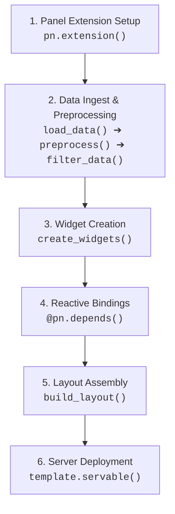
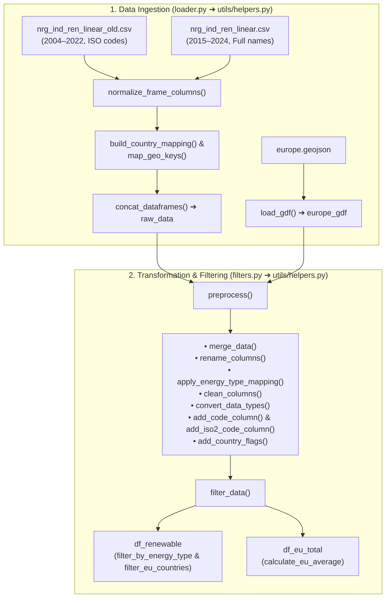
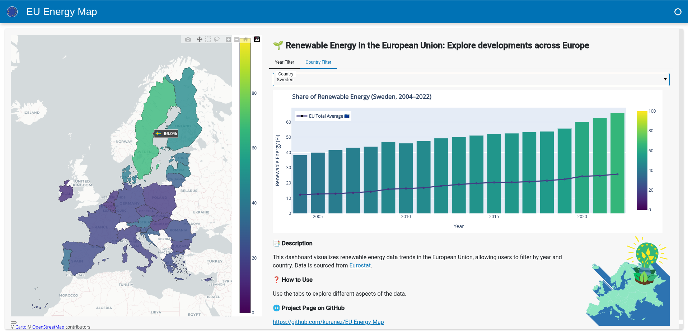

# **Documentation: EU Energy Map by @kuranez**

## **Project Summary**

**EU Energy Map** is an interactive geospatial dashboard for tracking and analyzing renewable energy adoption across the European Union from 2004 to 2024.
Built with **Python**, **HoloViz Panel**, and **Plotly**, the application integrates Eurostat data and GISCO geographic boundaries into a cohesive analytical tool. It enables policymakers, researchers, and citizens to:
- **Explore spatial disparities:** Visualize country-by-country renewable adoption using dynamic choropleth maps.
- **Benchmark national progress:** Compare individual member states directly against EU-wide averages over a 20-year transition timeline.
- **Seamless data exploration:** Filter instantly by year and country through a responsive, reactive interface.

---

## **Table of Contents**

<!-- TOC depthFrom:1 depthTo:6 withLinks:1 updateOnSave:1 orderedList:0 -->

- [**Documentation: EU Energy Map by @kuranez**](#documentation-eu-energy-map-by-kuranez)
	- [**Project Summary**](#project-summary)
	- [**Table of Contents**](#table-of-contents)
	- [**📦 Python Dependencies**](#-python-dependencies)
	- [**📊 Datasets**](#-datasets)
		- [1. Renewable Energy Data (Eurostat) - 2004–2022](#1-renewable-energy-data-eurostat-20042022)
		- [2. Renewable Energy Data (Eurostat) - 2015–2024](#2-renewable-energy-data-eurostat-20152024)
		- [3. Geographic Boundaries (GISCO - Eurostat)](#3-geographic-boundaries-gisco-eurostat)
	- [**📁 Contents**](#-contents)
	- [**📖 Documentation**](#-documentation)
		- [**I. Main dashboard entry point: `app.py`**](#i-main-dashboard-entry-point-apppy)
			- [**📦 Imports & Packages**](#-imports-packages)
				- [Standard Library](#standard-library)
				- [Third-Party Frameworks](#third-party-frameworks)
				- [Application Modules](#application-modules)
			- [**🔁 Application Workflow**](#-application-workflow)
				- [1. Panel Initialization (`pn.extension`)](#1-panel-initialization-pnextension)
				- [2. Loading & Preprocessing Data Pipeline](#2-loading-preprocessing-data-pipeline)
				- [3. Widget Creation](#3-widget-creation)
				- [4. Reactive Bindings (`@pn.depends`)](#4-reactive-bindings-pndepends)
				- [5. Layout Creation](#5-layout-creation)
				- [6. Serving the Application (`.servable()`)](#6-serving-the-application-servable)
			- [**▶️ Running the Application**](#-running-the-application)
		- [**II. Configuration: `config.py`**](#ii-configuration-configpy)
			- [**Key Configurations**](#key-configurations)
				- [1. Panel Extension Setup (`pn.extension`)](#1-panel-extension-setup-pnextension)
				- [2. Dynamic Filesystem Path Resolution (`pathlib.Path`)](#2-dynamic-filesystem-path-resolution-pathlibpath)
				- [3. Centralized Data Mappings & Constants](#3-centralized-data-mappings--constants)
			- [**Module Usage Overview**](#module-usage-overview)
		- [**III. Data Loading & Filtering Pipeline: `data/`**](#iii-data-loading-filtering-pipeline-data)
			- [**📦 Imports & Dependencies**](#-imports-dependencies)
				- [👉 Module: `data/loader.py`](#-module-dataloaderpy)
				- [👉 Module: `data/filters.py`](#-module-datafilterspy)
			- [**🔁 Data Pipeline Workflow**](#-data-pipeline-workflow)
				- [**1. Ingestion & Reconciliation: `loader.py`**](#1-ingestion-reconciliation-loaderpy)
					- [⚙️ Method documentation: `load_data(...)`](#-method-documentation-loaddata)
				- [**2. Preprocessing & Aggregation: `filters.py`**](#2-preprocessing-aggregation-filterspy)
					- [⚙️ Method documentation: `preprocess(data, europe)`](#-method-documentation-preprocessdata-europe)
					- [⚙️ Method documentation: `filter_data(merged)`](#-method-documentation-filterdatamerged)
			- [**Active Datasets in Pipeline**](#active-datasets-in-pipeline)
				- [👉 Data: `data/nrg_ind_ren_linear_old.csv`](#-data-datanrgindrenlinearoldcsv)
				- [👉 Data: `data/nrg_ind_ren_linear.csv`](#-data-datanrgindrenlinearcsv)
		- [**IV. Dashboard Components: `components/`**](#iv-dashboard-components-components)
			- [**1. Geospatial Map Component: `components/map.py`**](#1-geospatial-map-component-componentsmappy)
				- [📦 Imports & Dependencies](#-imports-dependencies)
				- [🎚️ Module Constants](#-module-constants)
				- [⚙️ Method Documentation: `create_choropleth_map(...)`](#-method-documentation-createchoroplethmap)
			- [**2. User Input Controls: `components/widgets.py`**](#2-user-input-controls-componentswidgetspy)
				- [📦 Imports & Dependencies](#-imports-dependencies)
				- [⚙️ Method Documentation: `create_widgets(...)`](#-method-documentation-createwidgets)
			- [**3. Chart Visualizations: `components/charts/`**](#3-chart-visualizations-componentscharts)
		- [**V. Dashboard Layout: `layout/dashboard.py`**](#v-dashboard-layout-layoutdashboardpy)
			- [📦 Imports & Dependencies](#-imports-dependencies)
			- [⚙️ Method Documentation: `build_layout(...)`](#-method-documentation-buildlayout)
			- [📊 Layout Structure](#-layout-structure)
		- [**VI. Utilities: `utils/`**](#vi-utilities-utils)
			- [👉 Module: `utils/helpers.py`](#-module-utilshelperspy)
			- [👉 Module: `utils/mapping.py`](#-module-utilsmappingpy)
			- [👉 Module: `utils/colors.py`](#-module-utilscolorspy)
			- [👉 Module: `utils/flags.py`](#-module-utilsflagspy)
		- [**VII. Assets: `assets/`**](#vii-assets-assets)
			- [📂 Files](#-files)
		- [**VIII. Geodata: `geo/`**](#viii-geodata-geo)
			- [🌍 Data: `geo/europe.geojson`](#-data-geoeuropegeojson)
	- [**Links & Author**](#links-author)
		- [Resources](#resources)
		- [License](#license)

<!-- /TOC -->

---

## **📦 Python Dependencies**

- **Core:** `os`, `json`, `pathlib`, `typing`, `glob`
- **Data Handling:** `pandas`, `geopandas`
- **Visualization:** `plotly.express`, `plotly.graph_objects`, `plotly.io`
- **Dashboard UI:** `panel`

---

## **📊 Datasets**

### 1. Renewable Energy Data (Eurostat) - 2004–2022

- **File:** `nrg_ind_ren_linear_old.csv`
- **Source:** [Eurostat – Renewable Energy](https://ec.europa.eu/eurostat/databrowser/view/nrg_ind_ren/default/table?lang=en)
- **Years:** 2004–2022
- **Columns:** Country codes, energy type, unit, value (%), flags
- **Categories:** Total renewables, electricity, heating/cooling, transport

### 2. Renewable Energy Data (Eurostat) - 2015–2024

- **File:** `nrg_ind_ren_linear.csv`
- **Source:** [Eurostat – Renewable Energy](https://ec.europa.eu/eurostat/databrowser/view/nrg_ind_ren/default/table?lang=en)
- **Years:** 2015–2024
- **Columns:** Country names, energy type, unit, value (%), flags, confidentiality status
- **Categories:** Total renewables

### 3. Geographic Boundaries (GISCO - Eurostat)

- **File:** `europe.geojson`
- **Source:** [GISCO – Eurostat](https://ec.europa.eu/eurostat/web/gisco/geodata/administrative-units/countries)
- **Year:** 2024
- **Format:** GeoJSON (EPSG:4326), scale 1:20M

---

## **📁 Contents**

```txt
eu-energy-map/
|
├── app.py                            # Main dashboard entry point
├── config.py                         # Configurations & centralized mappings
|
├── docs/
│   ├── documentation.md              # Project Documentation
│   └── notebook.ipynb                # Interactive Notebook
|
├── data/
│   ├── loader.py                     # Coordinates data loading pipeline
│   ├── filters.py                    # Coordinates preprocessing and filtering pipeline
│   ├── nrg_ind_ren_linear_old.csv    # Eurostat renewable energy data (2004–2022)
│   └── nrg_ind_ren_linear.csv        # Eurostat renewable energy data (2015–2024)
|
├── components/
│   ├── charts/
│   │   ├── bar_chart_by_country.py   # Bar chart: Country vs EU benchmark
│   │   └── bar_chart_by_year.py      # Bar chart: All countries by year
│   │
│   ├── map.py                        # Interactive choropleth map (Plotly 6 MapLibre)
│   └── widgets.py                    # Dashboard widgets (sliders, selectors)
|
├── layout/
│   └── dashboard.py                  # Layout composition for Panel
|
├── utils/                            # Helper functions & mappings
│   ├── helpers.py                    # Centralized Pandas/GeoPandas helpers & flag utilities
│   ├── mapping.py                    # Mapping getter and applier utilities
│   ├── colors.py                     # Color scales & conversion
│   └── flags.py                      # Backward-compatibility re-export module
|
├── assets/
│   ├── europe-renewables-500px.png   # Dashboard image
│   └── logo-500px.png                # Logo
|
└── geo/
    └── europe.geojson                # European country boundaries (GeoJSON)
```

---

## **📖 Documentation**

### **I. Main dashboard entry point: `app.py`**

`app.py` acts as the orchestrator of the entire application. It initializes the web framework, runs the data ingestion and transformation pipeline, instantiates interactive widgets, binds reactive callbacks to visualization generators, and serves the assembled dashboard.

---

#### **📦 Imports & Packages**

The script organizes dependencies into standard library utilities, third-party frameworks, and local modular components:

##### Standard Library
* **`pathlib.Path`**: Provides cross-platform, OS-independent path resolution relative to `__file__`. Ensures datasets and GeoJSON files are resolved reliably regardless of the working directory from which `panel serve` is executed.
* **`typing.cast`**: Provides static type hinting, explicitly asserting that raw objects returned from data loading conform to `pd.DataFrame` and `gpd.GeoDataFrame` for code clarity and linter validation.

##### Third-Party Frameworks
* **`panel (pn)`**: The core reactive dashboard framework. Manages the Bokeh server lifecycle, JavaScript/CSS extension loading, interactive widget synchronization, reactive function decorators (`@pn.depends`), and the template layout.
* **`pandas (pd)`**: The primary data manipulation engine used for filtering, slicing, aggregating, and passing structured tabular data to charts.
* **`geopandas (gpd)`**: Extends Pandas with geospatial capabilities, managing European country geographic boundaries and geometry attributes as a `GeoDataFrame`.

##### Application Modules
* **`data.loader (load_data)`**: Loads raw CSV files and GeoJSON into DataFrames.
* **`data.filters (preprocess, filter_data)`**: Merges energy metrics with country boundaries, cleans columns, normalizes country codes, filters for EU member states, and calculates EU-wide aggregate averages.
* **`components.widgets (create_widgets)`**: Factory function creating the interactive UI controllers (the Year slider and Country selector).
* **`components.map (create_choropleth_map)`**: Generates the interactive Plotly MapLibre choropleth map.
* **`components.charts.bar_chart_by_year (create_bar_chart_year)`**: Builds the ranked bar chart for all EU nations in a given year.
* **`components.charts.bar_chart_by_country (create_bar_chart_country)`**: Generates the 2004–2024 time-series comparison chart for a selected country.
* **`layout.dashboard (build_layout)`**: Assembles charts, widgets, description panes, and branding assets into a structured Panel template.

---

#### **🔁 Application Workflow**

The execution flow of `app.py` follows a 6-stage lifecycle:


```mermaid
flowchart TD
    A["1. Panel Extension Setup<br/><code>pn.extension()</code>"] --> B["2. Data Ingest & Preprocessing<br/><code>load_data() ➔ preprocess() ➔ filter_data()</code>"]
    B --> C["3. Widget Creation<br/><code>create_widgets()</code>"]
    C --> D["4. Reactive Bindings<br/><code>@pn.depends()</code>"]
    D --> E["5. Layout Assembly<br/><code>build_layout()</code>"]
    E --> F["6. Server Deployment<br/><code>template.servable()</code>"]
```

##### 1. Panel Initialization (`pn.extension`)
Registers required JavaScript dependencies (`'tabulator'`, `'plotly'`), activates the Material Design UI theme, and sets responsive sizing behavior (`sizing_mode='stretch_width'`).

##### 2. Loading & Preprocessing Data Pipeline
* Computes absolute paths for both historical (`nrg_ind_ren_linear_old.csv`) and modern (`nrg_ind_ren_linear.csv`) datasets alongside `europe.geojson`.
* Loads raw inputs via `load_data(..., return_raw=True)`.
* Merges tabular data with geographic polygons using `preprocess()`.
* Validates DataFrame types and extracts clean subsets via `filter_data()`:
  * `df_renewable`: Individual country metrics filtered to EU member states.
  * `df_eu_total`: Mean annual renewable share across all EU nations.

##### 3. Widget Creation
Calls `create_widgets(df_renewable)` to generate interactive Panel widgets populated with actual data boundaries:
* **`year_slider`**: An `IntSlider` spanning years 2004–2024 (defaulting to 2024).
* **`country_select`**: A `Select` dropdown populated with unique, sorted EU country names (defaulting to Germany).

##### 4. Reactive Bindings (`@pn.depends`)
Establishes dynamic event listeners linking widget values to visualization update functions:
* **`map_view(year)`**: Listens to `year_slider.param.value`, slices `df_renewable` by year, and re-renders the choropleth map.
* **`bar_by_year(year)`**: Listens to `year_slider.param.value`, slices by year, and re-renders the annual member state comparison bar chart.
* **`bar_by_country(country)`**: Listens to `country_select.param.value`, filters data for that country, and re-renders the 20-year trajectory comparison chart.

##### 5. Layout Creation
Passes the reactive functions and widgets into `build_layout()`, constructing a responsive side-by-side dashboard structure inside a `FastListTemplate` with navigation tabs, descriptive markdown, and image assets.

##### 6. Serving the Application (`.servable()`)
Attaches the completed template to Bokeh's server document context via `template.servable()`.

---

#### **▶️ Running the Application**

Launch the development server from the repository root:

```bash
panel serve app.py --show --autoreload
```

**Options:**
* `--show`: Automatically opens the dashboard in your default browser at `http://localhost:5006/app`.
* `--autoreload`: Automatically reloads the application when project files are modified.

---

### **II. Configuration: `config.py`**

The `config.py` module serves as the single source of truth for application settings, UI extension parameters, API credentials, filepaths, and data transformation dictionaries. Centralizing these parameters ensures that all data mappings, column names, and droplists are defined in one place.

---

#### **Key Configurations**

##### 1. Panel Extension Setup (`pn.extension`)
Initializes the HoloViz Panel runtime environment before dashboard components are loaded:
```python
pn.extension('tabulator', 'plotly', design='material')
```
* **`'plotly'`**: Injects the Plotly.js rendering engine into the browser runtime, enabling interactive WebGL/MapLibre map and chart panes.
* **`'tabulator'`**: Loads the Tabulator JavaScript dependency for high-performance interactive data tables.
* **`design='material'`**: Enforces Google Material Design styling across all dashboard widgets, inputs, and template containers for a cohesive look.

##### 2. Dynamic Filesystem Path Resolution (`pathlib.Path`)
Uses Python's `pathlib` to anchor asset paths relative to `config.py` itself, ensuring static assets load reliably across operating systems and deployment environments:
* **`BASE_DIR`**: Resolves the root directory of the repository (`Path(__file__).parent`).
* **`ASSETS_DIR`**: Points to the visual media folder (`assets/`).
* **`LOGO_PATH`**: Path to `assets/logo-500px.png`, used as the header emblem in the dashboard template.
* **`PICTURE_PATH`**: Path to `assets/europe-renewables-500px.png`, displayed as the featured graphic alongside the dashboard description.

##### 3. Centralized Data Mappings & Constants
* **`COLUMN_MAPPING`**: Standardizes Eurostat columns (`nrg_bal` $\rightarrow$ `Energy Type`, `TIME_PERIOD` $\rightarrow$ `Year`, `OBS_VALUE` $\rightarrow$ `Renewable Percentage`, `NAME_ENGL` $\rightarrow$ `Country`).
* **`COLUMNS_TO_DROP`**: Defines technical metadata columns to be stripped from final DataFrames (`DATAFLOW`, `LAST UPDATE`, `freq`, `unit`, `OBS_FLAG`, `CONF_STATUS`, `geo`, `geo_key`).
* **`ENERGY_TYPE_MAPPING`**: Maps raw Eurostat energy balance codes to human-readable titles (e.g. `'Renewable energy - overall'` $\rightarrow$ `'Renewable Energy Total'`).
* **`COUNTRY_CODE_MAPPING`**: Re-maps country codes for flag compatibility (e.g. `'EL'` $\rightarrow$ `'GR'`).
* **`EU_COUNTRIES`**: Official set containing the 27 EU member state country codes.
* **`NORMALIZE_ENERGY_MAPPING`**: Normalizes legacy balance codes across multi-version Eurostat exports.
* **`FINAL_COLUMNS`**: Specifies the canonical schema and column order for processed DataFrames.
* **`MAPBOX_TOKEN`**: Holds authentication token if proprietary Mapbox basemap styles are used.

---

#### **Module Usage Overview**

| Variable / Constant | Consumer Modules | Purpose |
| :--- | :--- | :--- |
| **`pn.extension(...)`** | Global runtime | Pre-registers client-side dependencies before UI rendering |
| **`COLUMN_MAPPING`** | [utils/helpers.py](file:///home/kuranez/Projects_new/python/eu-energy-map/utils/helpers.py), [utils/mapping.py](file:///home/kuranez/Projects_new/python/eu-energy-map/utils/mapping.py) | Standardizes technical column names |
| **`COLUMNS_TO_DROP`** | [utils/helpers.py](file:///home/kuranez/Projects_new/python/eu-energy-map/utils/helpers.py), [utils/mapping.py](file:///home/kuranez/Projects_new/python/eu-energy-map/utils/mapping.py) | Defines metadata columns to drop |
| **`ENERGY_TYPE_MAPPING`**| [utils/helpers.py](file:///home/kuranez/Projects_new/python/eu-energy-map/utils/helpers.py), [utils/mapping.py](file:///home/kuranez/Projects_new/python/eu-energy-map/utils/mapping.py) | Maps energy category codes to descriptive names |
| **`COUNTRY_CODE_MAPPING`**| [utils/helpers.py](file:///home/kuranez/Projects_new/python/eu-energy-map/utils/helpers.py), [utils/mapping.py](file:///home/kuranez/Projects_new/python/eu-energy-map/utils/mapping.py) | Converts EL to GR for flag emoji rendering |
| **`EU_COUNTRIES`** | [utils/helpers.py](file:///home/kuranez/Projects_new/python/eu-energy-map/utils/helpers.py), [utils/mapping.py](file:///home/kuranez/Projects_new/python/eu-energy-map/utils/mapping.py) | Filters data exclusively for EU27 member states |
| **`LOGO_PATH`** | [layout/dashboard.py](file:///home/kuranez/Projects_new/python/eu-energy-map/layout/dashboard.py) | Configures top navigation bar logo in `FastListTemplate` |
| **`PICTURE_PATH`** | [layout/dashboard.py](file:///home/kuranez/Projects_new/python/eu-energy-map/layout/dashboard.py) | Renders thumbnail preview image in the descriptive side-panel |

---

### **III. Data Loading & Filtering Pipeline: `data/`**

The `data/` directory houses the orchestration scripts for data loading and filtering. Following a clean architecture, these modules contain **no direct Pandas/GeoPandas operations** and instead delegate all file loading, normalizations, merges, type conversions, and aggregations to `utils.helpers`.

The pipeline is split into two specialized modules:
1. **Module: `loader.py`**: Coordinates file retrieval, schema normalization, country key reconciliation, and multi-file concatenation.
2. **Module: `filters.py`**: Coordinates spatial merging with country geometries, standardizes energy terminology, filters for official EU member states, and calculates aggregate benchmarks.

---

#### **📦 Imports & Dependencies**

##### 👉 Module: `data/loader.py`
* **`os`**: Path validation (`os.path.exists`, `os.PathLike`).
* **`typing (Union, Tuple, Sequence)`**: Strict type signatures for input arguments and return structures.
* **`pandas (pd)` & `geopandas (gpd)`**: Type hints for DataFrames and GeoDataFrames.
* **`utils.helpers`**: Imports dedicated helper functions: `load_csv_data`, `load_gdf`, `normalize_frame_columns`, `build_country_mapping`, `map_geo_keys`, `concat_dataframes`, `merge_data`, `rename_columns`, `apply_energy_type_mapping`, `clean_columns`, `convert_data_types`, `add_code_column`, `add_iso2_code_column`, `add_country_flags`, `select_columns`, `iso2_to_flag`.

##### 👉 Module: `data/filters.py`
* **`typing.Union`**: Type annotations.
* **`pandas (pd)` & `geopandas (gpd)`**: Type annotations.
* **`utils.helpers`**: Imports dedicated helper functions: `build_country_mapping`, `map_geo_keys`, `merge_data`, `rename_columns`, `apply_energy_type_mapping`, `clean_columns`, `convert_data_types`, `add_code_column`, `deduplicate_rows`, `add_iso2_code_column`, `add_country_flags`, `filter_by_energy_type`, `filter_eu_countries`, `calculate_eu_average`.

---

#### **🔁 Data Pipeline Workflow**


```mermaid
flowchart TD
    subgraph Ingestion ["1. Data Ingestion (loader.py ➔ utils/helpers.py)"]
        A["nrg_ind_ren_linear_old.csv<br/>(2004–2022, ISO codes)"] --> C["normalize_frame_columns()"]
        B["nrg_ind_ren_linear.csv<br/>(2015–2024, Full names)"] --> C
        C --> D["build_country_mapping() &<br/>map_geo_keys()"]
        D --> E["concat_dataframes() ➔ raw_data"]
        GEO["europe.geojson"] --> GDF["load_gdf() ➔ europe_gdf"]
    end

    subgraph Transformation ["2. Transformation & Filtering (filters.py ➔ utils/helpers.py)"]
        E & GDF --> F["preprocess()"]
        F --> G["• merge_data()<br/>• rename_columns()<br/>• apply_energy_type_mapping()<br/>• clean_columns()<br/>• convert_data_types()<br/>• add_code_column() & add_iso2_code_column()<br/>• add_country_flags()"]
        G --> H["filter_data()"]
        H --> I["df_renewable<br/>(filter_by_energy_type & filter_eu_countries)"]
        H --> J["df_eu_total<br/>(calculate_eu_average)"]
    end
```

---

##### **1. Ingestion & Reconciliation: `loader.py`**

###### ⚙️ Method documentation: `load_data(...)`

```python
def load_data(
    data_path: Union[str, Sequence[str]] = (
        './data/nrg_ind_ren_linear.csv',
        './data/nrg_ind_ren_linear_old.csv',
    ),
    geo_path: str = './geo/europe.geojson',
    return_raw: bool = False
) -> Union[pd.DataFrame, Tuple[pd.DataFrame, gpd.GeoDataFrame]]:
```

* **Description:**  
  Main ingestion function that reads boundary polygons and tabular energy CSVs, harmonizes country identifiers, and returns processed data or raw tuples.
* **Process Flow:**
  1. Validates file existence using `os.path.exists`.
  2. Loads `europe.geojson` using `load_gdf()`.
  3. Builds a dynamic country dictionary (`build_country_mapping()`) to unify full names (`"Germany"`) and codes (`"DE"`) under standard `CNTR_ID` keys (`map_geo_keys()`).
  4. Normalizes column headers and legacy codes using `normalize_frame_columns()`.
  5. Combines datasets using `concat_dataframes()`.
  6. If `return_raw=True`, returns `(data, europe_gdf)`.
  7. Otherwise, executes the full cleaning pipeline via helper functions and returns `select_columns(merged_data)`.

---

##### **2. Preprocessing & Aggregation: `filters.py`**

###### ⚙️ Method documentation: `preprocess(data, europe)`

```python
def preprocess(data: pd.DataFrame, europe: Union[pd.DataFrame, gpd.GeoDataFrame]) -> pd.DataFrame:
```

* **Description:**  
  Merges raw tabular energy statistics with European country geometries and prepares the data for visualization using helper functions.
* **Process Flow:**
  1. Harmonizes country keys using `build_country_mapping()` and `map_geo_keys()`.
  2. Merges geometries and energy statistics via `merge_data()`.
  3. Standardizes column names (`rename_columns()`) using `COLUMN_MAPPING`.
  4. Converts category codes into descriptive names (`apply_energy_type_mapping()`).
  5. Strips metadata columns (`clean_columns()`).
  6. Coerces numbers and rounds percentages (`convert_data_types()`).
  7. Assigns plotting code (`add_code_column()`) and ISO2 code (`add_iso2_code_column()`).
  8. Deduplicates records (`deduplicate_rows()`) and appends flags (`add_country_flags()`).

###### ⚙️ Method documentation: `filter_data(merged)`

```python
def filter_data(merged: pd.DataFrame) -> tuple[pd.DataFrame, pd.DataFrame]:
```

* **Description:**  
  Filters preprocessed data for EU member states and calculates annual EU benchmark averages.
* **Process Flow:**
  1. Filters for `'Renewable Energy Total'` via `filter_by_energy_type()`.
  2. Filters for the 27 EU member states via `filter_eu_countries()`.
  3. Deduplicates country/year entries via `deduplicate_rows()`.
  4. Computes annual benchmark means across the EU via `calculate_eu_average()`.
  5. Returns `(df_renewable, df_eu_total)`.

---

#### **Active Datasets in Pipeline**

##### 👉 Data: `data/nrg_ind_ren_linear_old.csv`
Eurostat historical baseline dataset covering years **2004–2022**. Contains sectoral breakdowns (`REN`, `REN_ELC`, `REN_HEAT_CL`, `REN_TRA`) and 2-letter country codes.

##### 👉 Data: `data/nrg_ind_ren_linear.csv`
Eurostat modern update covering years **2015–2024**. Provides the latest overall renewable share figures indexed by full country names.

> 📌 _For further information see above section on datasets at the beginning of the document [**here**](#-datasets)._

---

### **IV. Dashboard Components: `components/`**

The `components/` directory encapsulates all visual presentation elements and user input controls. By isolating UI widgets, geospatial mapping, and charts from the main layout and data pipeline, each component remains modular, reusable, and easily testable.

---

#### **1. Geospatial Map Component: `components/map.py`**

This module constructs the interactive European choropleth map that visually displays renewable energy adoption by country for any selected year using Plotly 6 and MapLibre.

##### 📦 Imports & Dependencies
* **`plotly.graph_objects as go`**: Generates the high-level `Figure` container and the underlying tile-based `Choroplethmap` trace.
* **`json`**: Loads and parses the European boundary polygons from `geo/europe.geojson` into a Python dictionary.
* **`pathlib.Path`**: Computes the absolute path to the GeoJSON file relative to `__file__`.
* **`config.MAPBOX_TOKEN`**: Holds authentication tokens if proprietary Mapbox basemap styles are configured.
* **`utils.colors.get_colorscale`**: Supplies the standardized global `Viridis` colorscale for cohesive theming across the app.

##### 🎚️ Module Constants
* **`GEOJSON_PATH`**: Absolute filesystem path resolving to `geo/europe.geojson`.

##### ⚙️ Method Documentation: `create_choropleth_map(...)`

```python
def create_choropleth_map(df_year: pd.DataFrame) -> go.Figure:
```

* **Description:**  
  Renders an interactive choropleth map of Europe color-coded by renewable energy share (0%–100%) for a given year.
* **Parameters:**  
  * `df_year` (*pd.DataFrame*): DataFrame pre-filtered to a single target year. Must contain columns `Code` (`CNTR_ID`), `Renewable Percentage`, `Country`, and `Flag`.
* **Returns:**  
  * `fig` (*go.Figure*): A Plotly Figure object configured with the choropleth trace and map layout.
* **Key Implementation Details:**
  * **Feature Binding:** Binds `df_year['Code']` to the GeoJSON boundary IDs via `featureidkey="properties.CNTR_ID"`.
  * **Normalized Color Scale:** Sets `zmin=0` and `zmax=100` so colors remain consistent and comparable across different years.
  * **Custom Hover Tooltip:** Displays the country name, flag emoji, and percentage formatted to one decimal place using `customdata=df_year[['Country', 'Flag']].values`.
  * **Map Layout:** Configures MapLibre tile style (`map_style="carto-positron"` or `"carto-positron-nolabels"`), sets an initial European focal center (`{"lat": 56, "lon": 8}`), locks the zoom level to `2.75`, and removes outer margins (`margin={"r": 0, "t": 0, "l": 0, "b": 0}`).

---

#### **2. User Input Controls: `components/widgets.py`**

This module encapsulates the creation of interactive filter controls that allow users to drive dashboard updates.

##### 📦 Imports & Dependencies
* **`panel as pn`**: Supplies the reactive UI widget primitives (`IntSlider`, `Select`).

##### ⚙️ Method Documentation: `create_widgets(...)`

```python
def create_widgets(df_renewable: pd.DataFrame) -> tuple[pn.widgets.IntSlider, pn.widgets.Select]:
```

* **Description:**  
  Instantiates and configures the input controllers used to filter data across the dashboard.
* **Parameters:**  
  * `df_renewable` (*pd.DataFrame*): Cleaned renewable energy DataFrame. Used to dynamically query the unique list of available countries.
* **Returns:**  
  * `tuple`: A two-element tuple containing `(year_slider, country_select)`:
    1. **`year_slider` (`pn.widgets.IntSlider`)**:
       * Controls the target year for both the map and the annual comparison bar chart.
       * Configured with `start=2004`, `end=2024`, `step=1`, and defaults to `value=2024`.
    2. **`country_select` (`pn.widgets.Select`)**:
       * Controls the focus nation for the 20-year time-series comparison chart.
       * Populated dynamically with sorted, unique country names (`sorted(df_renewable['Country'].unique().tolist())`), defaulting to `value='Germany'`.

---

#### **3. Chart Visualizations: `components/charts/`**

In addition to the map and widgets, the `components/charts/` subpackage houses the secondary analytical figures:

* **Module: `bar_chart_by_year.py` (`create_bar_chart_year(df_year, year)`):**  
  Generates a sorted horizontal/vertical bar chart ranking all EU nations by renewable percentage for the selected year, overlaid with a benchmark dashed line representing the EU total average.
* **Module: `bar_chart_by_country.py` (`create_bar_chart_country(df_eu_total, df_country, country)`):**  
  Generates a multi-trace time-series chart showing an individual country’s 20-year trajectory (2004–2024) plotted directly against the EU-wide average line.

---

### **V. Dashboard Layout: `layout/dashboard.py`**

The `layout/dashboard.py` module assembles all UI building blocks into one Panel `FastListTemplate`: the interactive map, tabbed analytical charts, markdown guidance, and static imagery.

---

#### 📦 Imports & Dependencies
* **`panel as pn` + `panel.pane.Plotly`**: Provide the dashboard structure (`Row`, `Column`, `Tabs`) and Plotly pane wrappers.
* **`config (LOGO_PATH, PICTURE_PATH)`**: Inject static media paths from centralized configuration.

---

#### ⚙️ Method Documentation: `build_layout(...)`

* **Description:**  
  Builds and returns the complete dashboard shell.
* **Inputs:**  
  * `interactive_map`: Reactive choropleth map object.
  * `interactive_bar_year`: Reactive year-comparison bar chart object.
  * `interactive_bar_country`: Reactive country time-series chart object.
  * `year_slider`: Year filter widget.
  * `country_select`: Country filter widget.
* **Return value:**  
  * A `pn.template.FastListTemplate` instance ready for serving.

---

#### 📊 Layout Structure

1. **Header content**: Creates title and description markdown panes.
2. **Info block**: Combines description text with `PICTURE_PATH` image (`assets/europe-renewables-500px.png`) in a horizontal row.
3. **Analysis area**: Creates two tabs:
   * `"Year Filter"` (`year_slider` + annual ranking chart)
   * `"Country Filter"` (`country_select` + country trend chart)
4. **Main composition**: Renders a two-column view with the map on the left and all controls/content on the right, then wraps it in `FastListTemplate` with branding from `LOGO_PATH` (`assets/logo-500px.png`).

**Screenshot of the App showcasing the Layout:**



---

### **VI. Utilities: `utils/`**

The `utils/` package contains centralized helper functions, mapping utilities, color scale calculations, and flag emoji conversions.

---

#### 👉 Module: `utils/helpers.py`

The core helper module encapsulating all direct Pandas and GeoPandas operations for the application:

* **File & Data Loading:**
  * `load_csv_data(file_path)`: Reads CSV files with `low_memory=False`.
  * `load_gdf(file_path)`: Parses spatial GeoJSON files into a GeoPandas `GeoDataFrame`.
  * `load_geojson(file_path)`: Loads raw GeoJSON as Python dictionaries.
  * `load_and_combine_csv_data(folder_path, pattern)`: Concatenates matching CSVs from a directory.
  * `concat_dataframes(data_frames, ignore_index=True)`: Concatenates sequences of DataFrames safely.
* **Data Normalization & Mapping:**
  * `normalize_frame_columns(frame, mapping=None)`: Standardizes `siec`/`nrg_bal` column headers and normalizes codes using `NORMALIZE_ENERGY_MAPPING`.
  * `build_country_mapping(europe_gdf)`: Dynamically generates country name/code lookup dictionaries from GeoDataFrame metadata.
  * `map_geo_keys(frame, country_mapping, source_col='geo', target_col='geo_key')`: Harmonizes country identifiers into standard `CNTR_ID` keys.
  * `rename_columns(data, custom_mapping=None)`: Standardizes columns using `COLUMN_MAPPING` from `config.py`.
  * `apply_energy_type_mapping(data, custom_mapping=None)`: Maps energy codes to descriptive names using `ENERGY_TYPE_MAPPING`.
  * `clean_columns(data, columns_to_drop=None)`: Drops metadata columns using `COLUMNS_TO_DROP`.
  * `convert_data_types(data, columns=None, round_digits=1)`: Coerces numeric columns and rounds percentages.
  * `add_code_column(data, source_col='CNTR_ID', target_col='Code')`: Duplicates `CNTR_ID` as `Code` for plotting.
  * `add_iso2_code_column(data, source_column='Code', target_column='ISO2_Code')`: Maps country codes (EL $\rightarrow$ GR) using `COUNTRY_CODE_MAPPING`.
  * `add_iso2_code_columns(europe_gdf, data)`: Adds ISO2 codes to both spatial and tabular datasets.
* **Merging & Column Selection:**
  * `merge_data(europe, data, left_key='CNTR_ID', right_key='geo_key')`: Merges geographic and tabular DataFrames.
  * `select_columns(data, columns=None)`: Filters DataFrames to the canonical `FINAL_COLUMNS` schema.
* **Deduplication, Filtering & Aggregation:**
  * `deduplicate_rows(data, subset, keep='last')`: Deduplicates DataFrame rows across column subsets.
  * `filter_eu_countries(data, code_column='Code', additional_countries=None)`: Filters data for the 27 EU member states using `EU_COUNTRIES`.
  * `filter_by_energy_type(data, energy_type='Renewable Energy Total')`: Filters rows by energy category.
  * `calculate_eu_average(data, group_by='Year', target_col='Renewable Percentage')`: Calculates annual EU benchmark means.
* **Flag Emoji Utilities:**
  * `iso2_to_flag(iso2_code)`: Converts two-letter ISO country codes into corresponding unicode flag emojis.
  * `add_country_flags(data, source_column='ISO2_Code', target_column='Flag')`: Appends national flag emojis to the DataFrame.

---

#### 👉 Module: `utils/mapping.py`

Provides getter and application functions for centralized dictionaries in `config.py`:

* `get_energy_type_mapping(custom_mapping=None)`: Retrieves energy category mapping.
* `get_country_code_mapping(custom_mapping=None)`: Retrieves country code mapping.
* `get_eu_countries(additional_countries=None)`: Retrieves EU country codes set.
* `get_column_mapping(custom_mapping=None)`: Retrieves column renaming dictionary.
* `get_columns_to_drop(additional_columns=None)`: Retrieves column drop list.
* `apply_column_mapping(data, custom_mapping=None)`: Renames DataFrame columns.
* `apply_energy_type_mapping(data, custom_mapping=None)`: Applies energy type descriptions.

---

#### 👉 Module: `utils/colors.py`

Provides color-scale logic for map and chart rendering:

* Exposes a global Plotly Viridis palette (`get_colorscale()`), consumed by `components/map.py`.
* Normalizes percentages to a stable `[0, 1]` domain (`normalize_value`) with clamping, preventing out-of-range values from breaking visual mapping.
* Samples colors by value (`get_viridis_color`) and supports both `hex` and `rgba` output formats.
* Includes internal conversion helpers (`_tuple_to_hex`, `_hex_to_rgba`) to standardize color outputs for Plotly and UI styling.

---

#### 👉 Module: `utils/flags.py`

A lightweight re-export module that imports `iso2_to_flag` and `add_country_flags` from `utils.helpers` for backward compatibility across legacy scripts and tests.

---

### **VII. Assets: `assets/`**

The `assets/` directory contains static image resources used by the dashboard UI.

---

#### 📂 Files
* `logo-500px.png` — active header logo (`LOGO_PATH`) used by `FastListTemplate`.
* `europe-renewables-500px.png` — active illustration (`PICTURE_PATH`) shown in the dashboard description panel.

---

### **VIII. Geodata: `geo/`**

The `geo/` directory stores geographic boundary data used for map rendering.

---

#### 🌍 Data: `geo/europe.geojson`

* Source of country polygon geometries used by the choropleth layer.
* Loaded directly by `components/map.py` via `GEOJSON_PATH`.
* Also referenced in data-loading and tests as the canonical geospatial boundary file.
* Map linkage uses `featureidkey="properties.CNTR_ID"` and dataset country codes to bind tabular renewable metrics to GeoJSON features.

> 📌 _For further information see above section on datasets at the beginning of the document [**here**](#-datasets)._

---

## **Links & Author**

> - **Project on GitHub:** [EU-Energy-Map](https://github.com/kuranez/eu-energy-map)
>
> - **WebApp:** [View interactive map](https://apps.kuracodez.space/eu-energy-map/app)
>
> - **Author:** [Franz M. / kuranez](https://github.com/kuranez)
>
> - **Documentation:** [07/10/2026]


### Resources

> - [Holoviz Panel](https://panel.holoviz.org/) – A powerful Python framework for creating interactive web apps and dashboards, used for the UI in this project.
>
> - [Pandas](https://pandas.pydata.org/) – Essential for data manipulation and analysis, enabling efficient handling of Eurostat datasets.
>
> - [Geopandas](https://geopandas.org/) – Extends pandas to support geospatial data, making it easy to work with geographic boundaries and mapping.
>
> - [Jupyter](https://jupyter.org/) - An interactive environment for running Python code in notebooks, ideal for experimentation, documentation, and prototyping scripts.
>
> - [Docker Documentation](https://docs.docker.com/) - Official guides for containerizing, deploying, and running this app consistently across different environments.

### License

> This project is open source and available under the **MIT License**.
You may modify, distribute, and use it freely in your own projects.
